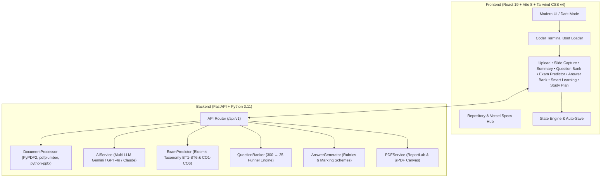

```
╔══════════════════════════════════════════════════════════════════════════════════╗
║   ____                  _   _   _       _                    _ _           _     ║
║  |  _ \ __ _ _ __ _   _| | | | | |_ __ (_)__   _____ _ __ __(_) |_ _   _  / \    ║
║  | |_) / _` | '__| | | | | | | | | '_ \| \ \ / / _ \ '__/ __| | __| | | |/ _ \   ║
║  |  __/ (_| | |  | |_| | |_| | | | | | | |\ V /  __/ |  \__ \ | |_| |_| / ___ \  ║
║  |_|   \__,_|_|   \__,_|\___/  |_|_| |_|_| \_/ \___|_|  |___/_|\__|\__, /_/   \_ ║
║                                                                     |___/        ║
║   AI EXAM PREDICTOR • REVISION WORKSPACE • AUTHOR & CODER: ROHAN MITRA          ║
╚══════════════════════════════════════════════════════════════════════════════════╝
```

# 🎓 Parul University AI Study Assistant & Exam Predictor

[](https://vercel.com/)
[](https://react.dev/)
[](https://vitejs.dev/)
[](https://tailwindcss.com/)
[](https://fastapi.tiangolo.com/)
[](LICENSE)
[](#-creator--ai-system-architect)

An intelligent, full-stack revision and exam preparation platform crafted specifically for students at **Parul University**. The assistant ingests syllabi, lecture notes, slide presentations, and past exam papers to extract core concepts, synthesize high-yield summaries, forecast exam question distributions using **Bloom's Taxonomy (BT1–BT6)** and **Course Outcomes (CO1–CO6)**, and generate comprehensive university-grade model answers.

---

## ⚡ Quick Deploy to Vercel

You can deploy the frontend repository to **Vercel** with one click or via the CLI:

### Option A: Via Vercel CLI (Instant)
```bash
# 1. Install Vercel CLI
npm install -g vercel

# 2. Deploy to Production
vercel --prod
```

### Option B: Via GitHub & Vercel Dashboard
1. Push this repository to GitHub:
   ```bash
   git add .
   git commit -m "feat: complete Parul University AI Study Assistant"
   git push origin main
   ```
2. Go to [vercel.com/new](https://vercel.com/new) and import your repository.
3. Vercel will automatically detect `vercel.json` and build `frontend/dist` with zero configuration!

---

## ✨ Features Overview

- 📎 **Dynamic Multi-Document Ingestion** — Batch upload 4–5+ PDFs, PPTX slide decks, Word documents, or text files. Text is dynamically parsed into topic graphs with zero hardcoded artifacts.
- 🎯 **Institutional Exam Predictor** — Synthesizes official Parul University examination blueprints:
  - **Section A (Module 1, 20 Marks)**: 2M definitions, 6M analytical questions, 6M caselets mapped to CO1–CO3.
  - **Section B (Module 2, 20 Marks)**: 2M definitions, 6M analytical questions, 6M caselets mapped to CO4–CO6.
- ❓ **300+ Question Engine & Visual Funnel** — Generates 300 practice questions (MCQs, 5-Mark Short Answers, 12-Mark Essays) with an AI ranking funnel (300 Total → 200 Important → 100 Likely → 25 Critical).
- 📝 **Structured Synthesis & Notes** — Generates a 4-chapter executive summary, module breakdown, mathematical formulas/rules, and exam scoring guidelines.
- 🧠 **Smart Learning & Adaptive SRS** — Leitner / SM-2 spaced repetition flashcards and Computerized Adaptive Diagnostic quizzes generated dynamically from the active document.
- 📸 **Screen & Slide Capture Tool** — Snip live digital whiteboards and slides directly from your browser with instant PDF export.
- 🖨️ **Institutional PDF Export Engine** — Generates formatted examination papers, answer keys, and revision study guides.
- 🛡️ **Clean Fresh Session Guarantee** — Clicking "New Session" purges all local storage and session cache, resetting the workspace to a pristine `0 PDFs, 0 Questions` state.

---

## 🏗️ System Architecture



---

## 💻 Local Development Setup

### Prerequisites
- **Node.js**: `v20+`
- **Python**: `3.11+` (optional for local backend)

### 1. Clone & Run Frontend
```bash
# Clone the repository
git clone https://github.com/your-username/StudyAssistant.git
cd StudyAssistant/frontend

# Install dependencies
npm install

# Start Vite dev server
npm run dev
```
Open **`http://localhost:5173`** in your browser.

### 2. Run Backend (Optional)
```bash
cd ../backend
python3 -m venv venv
source venv/bin/activate
pip install -r requirements.txt
uvicorn main:app --host 0.0.0.0 --port 8000 --reload
```

---

## ⚙️ Configuration

### Frontend (`frontend/.env`)
```env
VITE_API_URL=http://localhost:8000
```

### Backend (`backend/.env`)
```env
OPENAI_API_KEY=sk-...
ANTHROPIC_API_KEY=sk-ant-...
GEMINI_API_KEY=...
CORS_ORIGINS=http://localhost:5173,http://localhost:3000
```

---

## 📡 API Endpoints Reference

Base URL: `http://localhost:8000/api/v1`

| Method | Endpoint | Description | Request Format |
| :--- | :--- | :--- | :--- |
| `GET` | `/health` | Server and AI engine health check | None |
| `POST` | `/process` | Multi-format document text extraction | `multipart/form-data` |
| `POST` | `/generate-mega-questions` | Generates 300 practice questions | `form-data` (`text`, `num_questions`) |
| `POST` | `/rank-questions` | Ranks questions through the 300→25 funnel | JSON payload |
| `POST` | `/predict-exam` | Predicts exam question paper structure | `form-data` (`material_text`, `subject_name`) |
| `POST` | `/generate-answers` | Generates comprehensive model answers | JSON payload |
| `POST` | `/create-question-paper-pdf` | Generates university examination PDF | JSON payload |
| `POST` | `/create-answer-guide-pdf` | Generates study guide Q&A PDF | JSON payload |

---

## 👨‍💻 Creator & AI System Architect

- **Lead AI Architect & Full-Stack Coder**: **Rohan Mitra**
- **Role**: Maker, Multi-Agent System Architect & Lead Engineer
- **Platform**: Parul University AI Study Assistant (Exam Predictor & Syllabus AI)
- **Version**: `2.4.0 Production Release`

---

### 🎓 Made with dedication for Parul University Students
Crafted by **Rohan Mitra** to empower students to master their curriculum through intelligent, ethical AI study assistance.