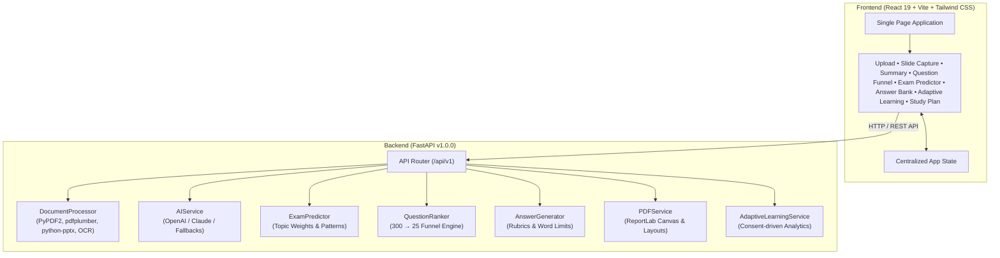

# 🎓 Parul University AI Study Assistant

[](#)
[](https://www.python.org/)
[](https://nodejs.org/)
[](LICENSE)

An intelligent, ethical full-stack revision and exam preparation platform crafted specifically for students at **Parul University**. The assistant ingests syllabi, lecture notes, slide presentations, and past exam papers to extract core concepts, synthesize high-yield summaries, forecast exam question distributions, and generate model answers.

---

## ✨ Features Overview

- 📄 **Multi-Format Document Ingestion** — Extract text, structure, and tabular data seamlessly from PDFs, PowerPoint decks (`.ppt`, `.pptx`), Word documents (`.doc`, `.docx`), text files, and images (`.png`, `.jpg`) with OCR fallback via Tesseract.
- 📸 **Lecture Slide & Screen Capture** — Snip live lecture streams, presentation slides, or digital whiteboards directly from your browser and bundle them into formatted PDF slide packets.
- 📝 **Smart AI Summarization** — Condense lengthy lecture decks and academic papers into key bullet takeaways, core definitions, and formula sheets powered by OpenAI GPT-4 / Anthropic Claude (with comprehensive offline mock fallbacks).
- 🧠 **300+ Question Engine & AI Funnel** — Generate extensive practice question sets and apply multi-criteria filtering to distill 300 potential questions down into the top 200, top 100, and essential top 25 high-probability questions.
- 🎯 **Exam Question Predictor** — Analyze past examination papers, syllabus emphasis, and keyword frequencies to predict semester exam blueprints complete with section marks, confidence ratings, and topic heatmaps.
- 💡 **Exemplary Answer Bank** — Instant generation of university-grade model answers aligned with Parul University marking criteria (2-mark short answers, 5-mark explanations, 10/15-mark comprehensive essays).
- 📊 **Ethical Adaptive Learning** — User-consented performance telemetry that pinpoints conceptual gaps, recommends high-priority study topics, and automatically scales question difficulty.
- 📅 **Strategic Revision Planner** — Structured study calendars and day-by-day milestone scheduling tailored to target exam dates and syllabus weights.

---

## 📸 Screenshots

> *Screenshots will be added in upcoming release builds.*

| Dashboard & Upload | Exam Predictor & Heatmap |
| :---: | :---: |
| *[Screenshot Placeholder: Document Ingestion & Quick Stats]* | *[Screenshot Placeholder: Predicted Question Paper & Confidence Scores]* |

| Question Funnel (300 → 25) | Answer Bank & Explanations |
| :---: | :---: |
| *[Screenshot Placeholder: AI Question Filtering]* | *[Screenshot Placeholder: Model Answers & Grading Rubric]* |

---

## 🏗️ System Architecture



---

## 🚀 Quick Start Guide

### Prerequisites
- **Node.js**: v20 or higher (`node -v`)
- **Python**: v3.11 or higher (`python3 -v`)
- **Package Managers**: `npm` and `pip`

---

### Backend Setup

1. **Navigate to the backend directory**:
   ```bash
   cd backend
   ```

2. **Create and activate a virtual environment**:
   ```bash
   python3 -m venv venv
   source venv/bin/activate    # On Windows: venv\Scripts\activate
   ```

3. **Install dependencies**:
   ```bash
   pip install -r requirements.txt
   ```

4. **Configure environment variables**:
   ```bash
   cp .env.example .env
   # Add your OpenAI or Anthropic API keys (optional; runs in mock mode without keys)
   ```

5. **Start the FastAPI development server**:
   ```bash
   uvicorn main:app --reload --host 0.0.0.0 --port 8000
   ```
   Interactive Swagger documentation will be accessible at: `http://localhost:8000/docs`

---

### Frontend Setup

1. **Navigate to the frontend directory**:
   ```bash
   cd frontend
   ```

2. **Install dependencies**:
   ```bash
   npm install
   ```

3. **Configure environment variables**:
   ```bash
   cp .env.example .env
   ```

4. **Start the Vite development server**:
   ```bash
   npm run dev
   ```
   The web application will launch at: `http://localhost:5173`

---

## 🔐 Environment Variables

### Backend (`backend/.env`)
| Variable | Required | Default | Description |
| :--- | :---: | :--- | :--- |
| `OPENAI_API_KEY` | Optional | `None` | OpenAI API key (`sk-...`). Enables GPT-powered summarization and questions. |
| `ANTHROPIC_API_KEY` | Optional | `None` | Anthropic Claude API key (`sk-ant-...`). Alternative AI generation engine. |
| `UPLOAD_MAX_SIZE_MB` | No | `10` | Maximum uploaded document size in megabytes. |
| `CORS_ORIGINS` | No | `http://localhost:5173,http://localhost:3000` | Comma-separated list of permitted browser origins. |

### Frontend (`frontend/.env`)
| Variable | Required | Default | Description |
| :--- | :---: | :--- | :--- |
| `VITE_API_URL` | No | `http://localhost:8000` | Base URL for FastAPI backend endpoints. |

---

## 📡 API Endpoints Reference

Base URL: `http://localhost:8000/api/v1`

| Method | Endpoint | Description | Request Body / Parameters |
| :--- | :--- | :--- | :--- |
| `GET` | `/health` | Server and AI engine health check | None |
| `POST` | `/upload` | Validate and upload study document | `multipart/form-data` (`file`) |
| `POST` | `/process` | Extract content, generate summary/questions | `multipart/form-data` (`file`, options) |
| `POST` | `/summarize` | Generate AI summary for raw text | JSON: `{ "text": string, "max_length": int }` |
| `POST` | `/generate-questions` | Create practice questions from text | JSON: `{ "text": string, "num_questions": int }` |
| `POST` | `/adaptive-learning/consent` | Grant explicit consent for learning metrics | JSON: `{ "consent_types": string[] }` |
| `POST` | `/adaptive-learning/withdraw-consent` | Revoke consent and purge telemetry | None |
| `POST` | `/adaptive-learning/record-performance` | Record question results and timing | JSON: Performance telemetry payload |
| `GET` | `/adaptive-learning/recommendations` | Retrieve personalized focus topics | None |
| `GET` | `/adaptive-learning/insights` | Fetch retention and study pattern insights | None |
| `GET` | `/adaptive-learning/suggest-difficulty` | Obtain recommended difficulty level | None |

---

## 🤝 Contributing Guidelines

1. **Fork the Repository** and create your branch from `main`:
   ```bash
   git checkout -b feature/your-feature-name
   ```
2. **Follow Code Conventions**:
   - Frontend: Functional React components with hooks, Tailwind utility classes.
   - Backend: PEP 8 styling, type annotations (`typing`), and Pydantic schemas.
3. **Verify Integrity**:
   - Run frontend build: `npm run build`
   - Test backend imports: `python -m pytest` or check service imports.
4. **Adhere to Ethics**: Ensure no features facilitate academic misconduct or circumvent legitimate institutional guidelines. See `ETHICAL_GUIDELINES.md`.
5. **Open a Pull Request** with a detailed explanation of changes.

---

## ⚖️ License

Distributed under the **MIT License**. See `LICENSE` for details.

---

### 🎓 Made with dedication for Parul University Students
Empowering students to master their curriculum through intelligent, ethical study assistance.